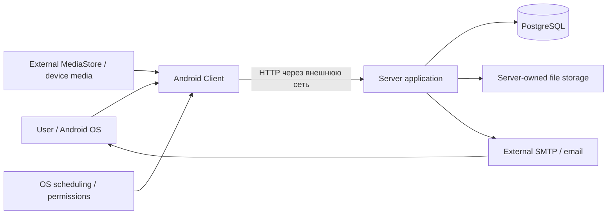

# Границы системы

## Component context

## Inside system

Android client, его local DB/settings/encrypted token persistence; server application; server PostgreSQL; server-owned file storage. PostgreSQL и local filesystem — dependencies серверного процесса, но их managed data входят в системную persistence boundary. ОС/устройства хранения, mounts и эксплуатационные процедуры не превращаются в функции приложения.

| Boundary | Внутренняя сторона | Внешнее условие / предел |
| --- | --- | --- |
| MediaStore → Android | Query Images/DCIM, URI reads, local snapshot/state | OS/provider задаёт видимость, bytes и permission; исходный device filesystem управляется вне приложения |
| OS → background | Client requests/constraints, observer registration | Реальные run/death/reboot/cancel сроки принадлежат OS/WorkManager |
| Android → Server | Десять HTTP operations, JSON/multipart, Bearer | Network delivery не атомарна с processing/ответом; configured endpoint — HTTP IPv4/port |
| Server → DB/FS | Logical metadata и physical storage | Отдельные persistence systems; mounts, crash durability и backup runtime неизвестны |
| Server → SMTP → User | Register/reset mail и codes | Доставка письма и переход по ссылке вне Android flow |

## External

MediaStore, Android OS permissions и scheduling, сеть, SMTP/email delivery, device filesystem вне управления приложения. Браузер/почтовый клиент могут открывать activation link. Другие HTTP-клиенты могут использовать более широкий Server API; их собственная реализация не входит в System As-Is.

System runtime layer, единая очередь Android+Server, device registry, sync session или общий persisted system enum отсутствуют. Mermaid nodes обозначают компоненты/границы, а не новый runtime.

В scope включены system-visible эффекты Server-only operations, например remote delete с сохранением Android belief. Полная внутренняя структура серверных controllers и клиентских классов остаётся в component specs.

## Источники

[S01](../../../../PhotoCloudServer/docs/spec/server-as-is/01-system-overview.md); [S05](../../../../PhotoCloudServer/docs/spec/server-as-is/05-api.md); [S06](../../../../PhotoCloudServer/docs/spec/server-as-is/06-auth-security.md); [S07](../../../../PhotoCloudServer/docs/spec/server-as-is/07-file-storage.md); [S12](../../../../PhotoCloudServer/docs/spec/server-as-is/12-background-processing.md); [A01](../../../../PhotoCloudClient/docs/spec/android-as-is/01-system-boundary.md); [A05](../../../../PhotoCloudClient/docs/spec/android-as-is/05-media-discovery.md); [A06](../../../../PhotoCloudClient/docs/spec/android-as-is/06-network-api.md); [A10](../../../../PhotoCloudClient/docs/spec/android-as-is/10-background-execution.md); [A13](../../../../PhotoCloudClient/docs/spec/android-as-is/13-configuration.md); [A17](../../../../PhotoCloudClient/docs/spec/android-as-is/17-server-client-consistency.md). Обозначения и область authority: [17-source-traceability.md](17-source-traceability.md).
