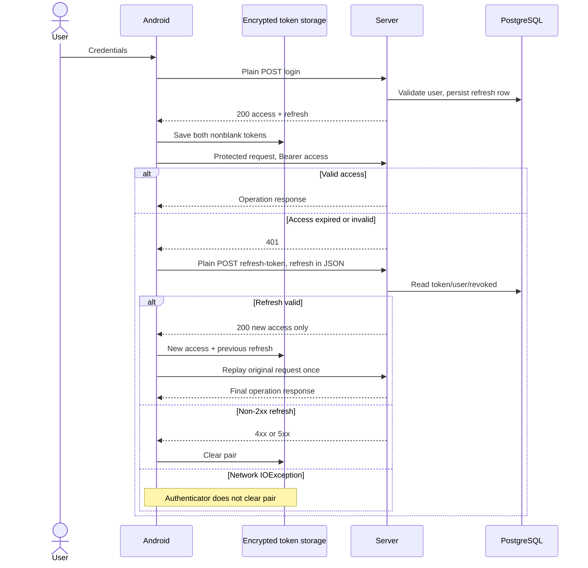

# Auth и session lifecycle

## Establishment и request sequence

Credentials принадлежат пользовательскому вводу; серверная User identity создаётся регистрацией. Сервер сохраняет BCrypt hash, disabled user и ACTIVATE code на три дня, отправляет письмо синхронно. Подтверждение ссылки включает user; Android встроенного confirm не имеет. Login проверяет password/enabled/banned, обновляет login time и создаёт новую refresh row. HTTP успех регистрации не доказывает SMTP delivery; повтор login создаёт новую refresh row.

Sequence описывает обычную ветку. Если failed request уже использовал старый access относительно текущего storage, Android повторяет с текущим access без нового refresh. Guard при response chain count>=2 прекращает повторный refresh. Конкуренция session writes рассмотрена ниже.

## Persistence и validity

| Concern | Android responsibility | Server responsibility / lifetime |
| --- | --- | --- |
| Password | Отправить; не сохраняет в preferences, форма не очищается явно | BCrypt hash; password4..20; login flags |
| Access | Encrypted pair, current Bearer каждого protected request | ACCESS signature/type/exp, sub→User; TTL20min, access row/revoke нет |
| Refresh | Та же encrypted pair; JSON body plain refresh | Full JWT DB row + revoked; JWT exp7days; no rotation/extension/consumption |
| Session display | tokens!=null; email из decoded JWT sub | UI display не участвует в authorization |
| Host binding | Pair не namespace по host/account | Principal/ownership текущего серверного endpoint |

Encrypted storage save/clear обновляет preferences через apply и in-memory flow. Завершённая persistence переживает process restart; немедленное изменение flow само по себе не является межкомпонентным commit. Пароль не persisted как credentials, но остаётся открытой строкой формы. Refresh storage в БД содержит bearer token полностью, expiry по JWT является проверяемым сроком; DB expires — его копия.

Access principal и roles берутся из актуального User, но enabled/banned повторно в access/refresh не проверяются. Reset пароля не отзывает ранее выданные токены. Это system-visible окно доступа, не новый auth policy requirement.

## Refresh outcomes

| Outcome | Persisted pair на Android | Original operation |
| --- | --- | --- |
| 200 с non-null access | Новый access + прежний refresh | Один replay; refresh срок не продлён |
| 2xx без body/access | Сохраняется | Replay не возвращается |
| 2xx blank access | Blank сохраняется: отдельной проверки нет | Replay с этим значением |
| Invalid/expired/unknown refresh401, revoked403 либо иные 4xx | Clear | Caller получает final auth/error handling |
| 5xx | Clear без доказанной недействительности refresh | То же; SYS-MISMATCH-004 / Android INT-AND-004 |
| IOException/timeout | Authenticator сам не clear | Exception обрабатывает caller; upload/stage могут просить retry |
| Повторный 401 | Guard сам не clear | Дальнейшего refresh этой цепочки нет |

Refresh plain request без access header согласован с Server public endpoint. Server5xx не означает revoke и не устанавливает клиентскую retry policy. Поэтому mismatch004 — потеря client session semantics, а не нарушение выдуманного retry requirement.

## Logout и recovery доступа

Logout требует настроенный URL и локальную pair. Protected request отправляет refresh. Server проверяет ownership, ставит revoked/revokedAt; повтор известного собственного refresh даёт200, unknown404, foreign403. Access остаётся пригодным до exp при остальных условиях validation.

Android clear происходит после HTTP response **до** проверки его успешности. Поэтому 4xx/5xx может одновременно показать ошибку и убрать pair; IOException/factory failure до clear может оставить pair. Logout не очищает media DB, settings или последний in-memory sync outcome. Успешный login/полученный logout Result вызывают scheduling reconcile. Если pair cleared, periodic отменяется и observer останавливается; one-time photo_sync не отменяется.

Authenticator clear не вызывает reconcile; coordinator не подписан на tokensFlow. Auth UI может перейти к форме через flow, тогда как observer/periodic ещё настроены. Worker не имеет entry token gate и может выполнить local scan/hash перед последующими auth errors. Отмена work не является гарантированным моментом прекращения blocking HTTP side effects.

## Concurrency и границы восстановления

Refresh lock не охватывает login/logout/URL change. Поздний in-flight refresh может перезаписать новую pair или восстановить прежнюю после logout; это условное interleaving, не воспроизведённый инцидент. URL для refresh берётся на момент authenticate. Связь original host/current host/pair не закреплена.

После cold start encrypted pair может сохраниться, а URL provider пуст до UI restore. Наличие сохранённого refresh не гарантирует headless recovery или доступность endpoint. Init Test Auth игнорирует Result; network failure может сохранить видимость logged-in. Product смысл logout/session expiry оставлен [SYS-OPEN-008](16-system-open-questions.md#sys-open-008).

## Источники

[S03](../../../../PhotoCloudServer/docs/spec/server-as-is/03-data-model.md); [S05](../../../../PhotoCloudServer/docs/spec/server-as-is/05-api.md); [S06](../../../../PhotoCloudServer/docs/spec/server-as-is/06-auth-security.md); [S10](../../../../PhotoCloudServer/docs/spec/server-as-is/10-errors-and-recovery.md); [A03](../../../../PhotoCloudClient/docs/spec/android-as-is/03-local-data-model.md); [A06](../../../../PhotoCloudClient/docs/spec/android-as-is/06-network-api.md); [A07](../../../../PhotoCloudClient/docs/spec/android-as-is/07-auth-session.md); [A10](../../../../PhotoCloudClient/docs/spec/android-as-is/10-background-execution.md); [A11](../../../../PhotoCloudClient/docs/spec/android-as-is/11-errors-retry-recovery.md); [A14](../../../../PhotoCloudClient/docs/spec/android-as-is/14-security-privacy.md); [A17](../../../../PhotoCloudClient/docs/spec/android-as-is/17-server-client-consistency.md). Обозначения и область authority: [17-source-traceability.md](17-source-traceability.md).
